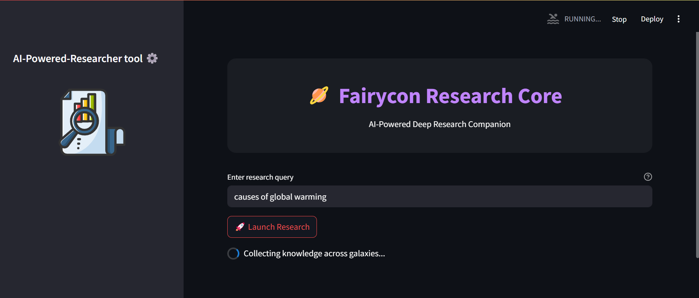
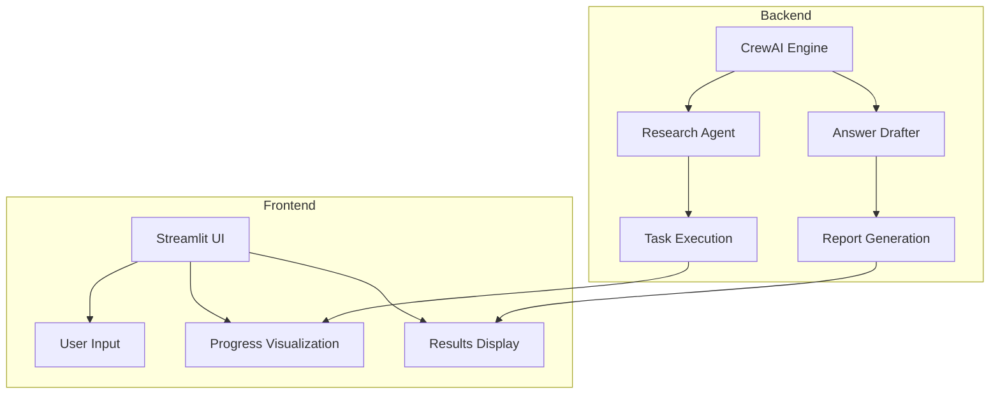
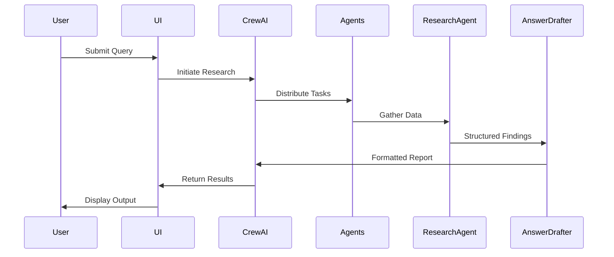
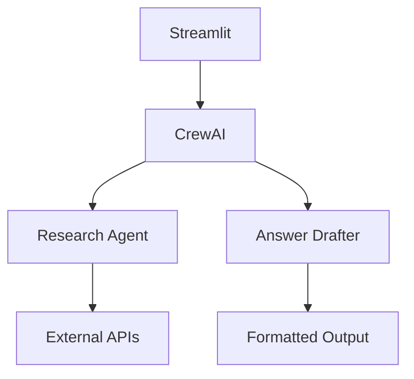
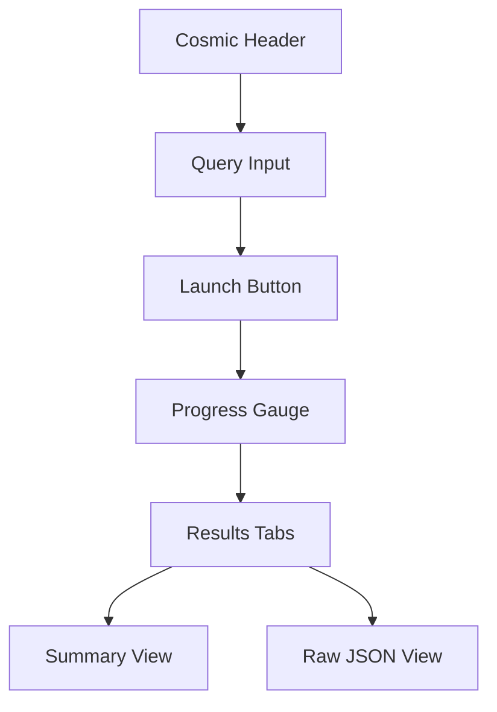

# 🌌 Fairycon Research Core



**Version**: 1.0.0  
**Last Updated**: 2025-02-28  
**License**: [Apache-2.0](LICENSE)

## 📌 Table of Contents
- [Overview](#-overview)
- [Features](#-features)
- [System Architecture](#-system-architecture)
- [UI Components](#-ui-components)
- [Installation](#-installation)
- [Usage](#-usage)
- [Configuration](#-configuration)
- [Contributing](#-contributing)
- [Troubleshooting](#-troubleshooting)
- [License](#-license)

## 🌟 Overview
Fairycon Research Core is an AI-powered research assistant with a cosmic-themed interface that transforms complex queries into professional reports using Streamlit and CrewAI.

```
+ Key Highlights:
- Dual-agent architecture (Research + Drafting)
- Real-time progress visualization
- Interactive cosmic UI with animations
- Professional report generation
- Error-resilient workflow
```

Fairycon Research Core is built with clarity and modularity in mind. The backend uses CrewAI's agent-task model to separate concerns—research and drafting are handled by two independent agents configured with specific roles and goals. These agents use pluggable tools (e.g., search, formatting) for domain-specific tasks. The frontend, built in Streamlit, makes the system interactive and delightful through clean layout, Lottie animations, and progress indicators. This clear separation between research logic and UI allows contributors to extend or replace individual modules easily.

## ✨ Features

### Research Capabilities
| Feature | Description |
|---------|-------------|
| 🔍 Multi-Source Research | Aggregates data from diverse sources |
| 📊 Intelligent Analysis | Identifies patterns and relationships |
| 📝 Professional Drafting | Generates publication-ready reports |

### UI Features
| Component | Description |
|-----------|-------------|
| 🎨 Cosmic Theme | Space-inspired design with animations |
| 📈 Progress Gauge | Visual research tracking |
| 📁 Results Tabs | Organized presentation of findings |

## ⚙️ System Architecture

### High-Level Overview


### Agent Configuration
```python
# Research Agent Configuration

research_agent = Agent(
    role="Research Specialist",
    goal="Search for relevant, detailed, indepth  and up-to-date information from trusted sources based on the user’s query.",
    backstory=(
        "You are a skilled analyst who excels at digging deep into documentation, articles, and data sources. "
        "Your job is to fetch facts, references, and key points that help answer complex questions accurately."
    ),  
    llm=llm,
    verbose=True,
    memory=True,
    allow_delegation= True
)
# Answer Drafter Configuration
answer_drafter_agent = Agent(
    role="Answer Composer",
    goal="Generate clear, insightful,very indepth and well-structured responses based on the research agent’s findings.",
    backstory=(
        "You specialize in transforming raw research into meaningful, human-readable answers. "
        "You value clarity, brevity, and completeness, always tailoring your output to the user’s needs."
    ),
    tools=[tool],  
    llm=llm,
    verbose=True,
    memory=True,
    allow_delegation= False
)

```

### Data Flow

## Technical Stack


## 💽 UI Components

### Interface Layout


### Key UI Functions
| Function | Description | Location |
|----------|-------------|----------|
| `load_animation()` | Loads Lottie animations | `main.py` |
| `inject_css()` | Applies cosmic styling | `main.py` |
| `progress_gauge()` | Creates progress visualization | `main.py` |

## 📥 Installation

### Prerequisites
- Python 3.8+
- Google Gemini API key
- Tavily Search API key (or alternative)

### Setup Instructions
1. Clone the repository:
   ```bash
   git clone https://github.com/your-repo/fairycon-research.git
   cd fairycon-research
   ```

2. Create environment file:
   ```bash
   echo "GOOGLE_API_KEY=your_key" > .env
   echo "TAVILY_API_KEY=your_key" >> .env
   ```

3. Install dependencies:
   ```bash
   pip install -r requirements.txt
   ```

## 🚀 Usage

1. Start the application:
   ```bash
   streamlit run main.py
   ```

2. In the browser:
   - Enter your research query
   - Click "🚀 Launch Research"
   - View real-time progress
   - Explore results in tabs

## ⚙️ Configuration

### Environment Variables
```ini
GOOGLE_API_KEY=your_gemini_key
TAVILY_API_KEY=your_search_key
CACHE_TTL=3600  # Cache duration in seconds
```

### Customizing Research
```python
# In research_task.py
research_task = Task(
    description="Custom research instructions",
    expected_output="Modified output format",
    tools=[CustomTool()]
)
```

## 🤝 Contributing

1. Fork the repository
2. Create your feature branch (`git checkout -b feature/improvement`)
3. Commit your changes (`git commit -m 'Add new feature'`)
4. Push to the branch (`git push origin feature/improvement`)
5. Open a Pull Request

**Guidelines**:
- Maintain existing code style
- Include relevant documentation updates
- Add tests for new features
- Keep dependencies minimal

## ⚠️ Troubleshooting

| Issue | Solution |
|-------|----------|
| API Connection Errors | Verify keys in `.env` file |
| Animation Not Loading | Check file path in `load_animation()` |
| Progress Gauge Issues | Clear browser cache and restart |
| Research Timeouts | Increase timeout in agent configuration |

## 📜 License
Distributed under the Apache 2.0 License. See `LICENSE` for more information.

---

> "Exploring the universe of knowledge with AI-powered research" - Fairycon Team

